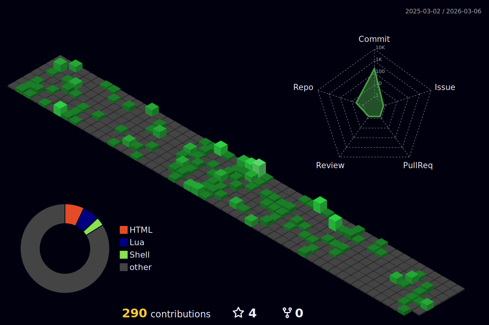

# About me

Hello world.

Coding hobbyist and GNU/Linux enthusiast.

- Using Windows is an obligation to be chained. 

- "GUI is just exercise of the Index finger."

Sky is the limit unless there are school assignments, no electricity or I just don't feel like it.

Tools & Languages:  

## Github Statistics

|  

  |  | 
|-|-|

