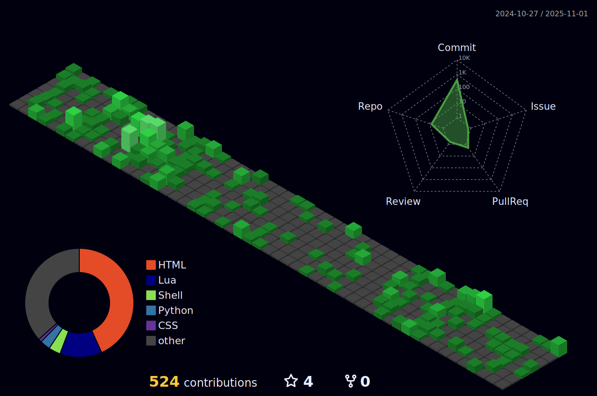

# About me

Hello world.

Coding hobbyist and GNU/Linux enthusiast.

- Full-time Penguin User

- "GUI is just exercise of the Index finger."

Tools & Languages:  

## Github Statistics

|   |   | 
|-|-|

